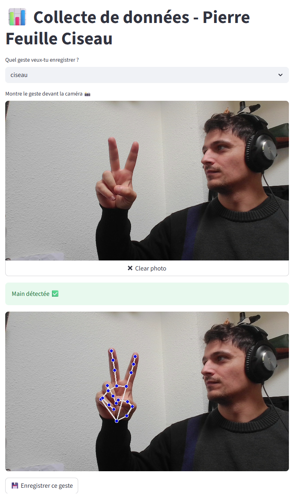
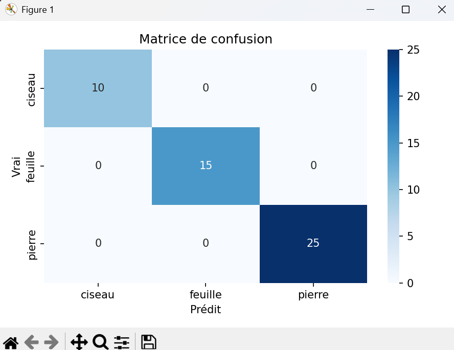
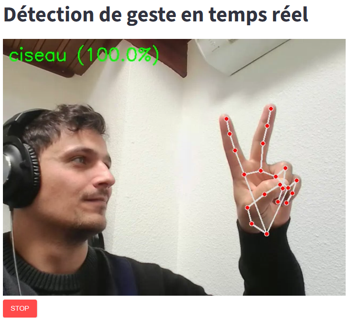
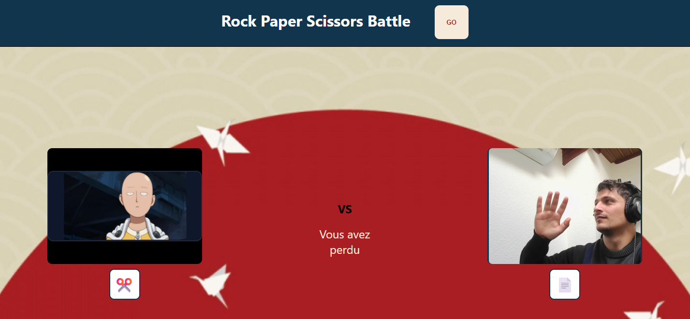

# Rock Paper Scissors IA

Un jeu de Pierre-Feuille-Ciseau intelligent utilisant la vision par ordinateur pour détecter les gestes de la main en temps réel.


## Fonctionnalités

- **Détection de gestes en temps réel** : Utilise MediaPipe pour reconnaître les gestes Pierre, Feuille, Ciseau
- **Intelligence artificielle** : IA adversaire avec sélection aléatoire des coups
- **Interface moderne** : Frontend React TypeScript avec capture webcam
- **API REST** : Backend FastAPI pour les prédictions de gestes
- **Collecte de données** : Interface Streamlit pour entraîner le modèle
- **Machine Learning** : Réseau de neurones TensorFlow pour la classification

## Installation

### Prérequis

- Python 3.10
- Node.js 16+
- npm ou yarn
- Webcam fonctionnelle
- Docker

# Utilisation

## 1. Collecte de données



Pour améliorer le modèle avec vos propres données :

```powershell
# Lancer l'interface de collecte
cd training
.\run_collect_data.bat
```

- Sélectionnez le geste à enregistrer (pierre, feuille, ciseau)
- Montrez votre geste devant la webcam
- Cliquez sur "Enregistrer" pour sauvegarder

## 2. Entraînement du modèle



```powershell
# Entraîner le modèle avec les nouvelles données
cd training
python train_model.py
```

## 3. Visualisation du model



```powershell
cd models
.\run_test_model.bat
```

## 4. Lancement de l'application 



```bash
cd app
./build-all.sh
docker compose up
```

## Comment jouer

1. **Autoriser l'accès webcam** : Le navigateur vous demandera l'autorisation
2. **Placer votre main** : Montrez votre geste devant la caméra
3. **Cliquer sur GO** : L'IA choisira son geste aléatoirement
4. **Voir le résultat** : Le gagnant sera affiché selon les règles classiques :
   - 🪨 Pierre bat ✂️ Ciseau
   - 📄 Feuille bat 🪨 Pierre  
   - ✂️ Ciseau bat 📄 Feuille

## Fonctionnement technique

### Pipeline de détection
1. **Capture vidéo** : La webcam capture les images en temps réel
2. **Extraction de landmarks** : MediaPipe détecte 21 points clés de la main
3. **Vectorisation** : Les coordonnées (x,y,z) sont converties en vecteur de 63 dimensions
4. **Prédiction** : Le réseau de neurones classifie le geste
5. **Affichage** : Le résultat est affiché dans l'interface

### Modèle de Machine Learning
- **Architecture** : Réseau dense (1024→1024→1024→3 neurones)
- **Entrée** : 63 features (21 landmarks × 3 coordonnées)
- **Sortie** : Probabilités pour 3 classes (pierre, feuille, ciseau)
- **Framework** : TensorFlow/Keras
- **Régularisation** : Dropout (30%) et BatchNormalization

## Données d'entraînement

Le modèle est entraîné sur :
- **Format** : Fichiers CSV avec coordonnées des landmarks
- **Classes** : pierre, feuille, ciseau
- **Division** : 80% entraînement / 20% validation
- **Augmentation** : Collecte interactive via Streamlit


## Développement

### Structure des API

**Backend (port 8000)**
- `POST /predict` : Upload d'image pour prédiction de geste
  - Input : multipart/form-data avec fichier image
  - Output : `{"gesture": "pierre|feuille|ciseau"}`

